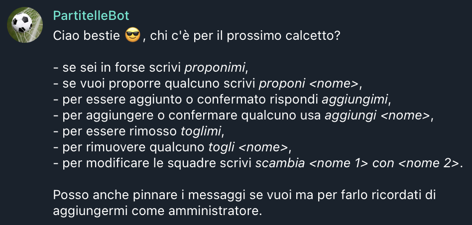
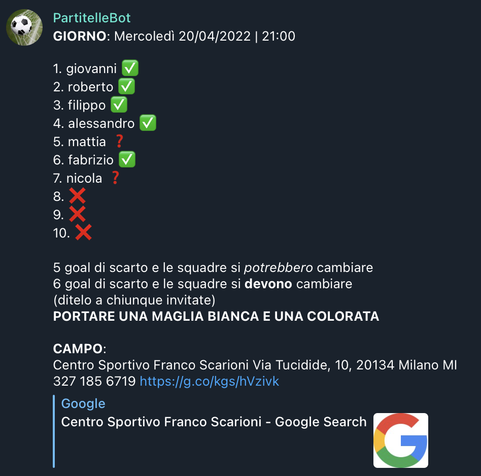

****
PartitelleBot
****

.. image:: https://img.shields.io/badge/Telegram-PartitelleBot-blue.svg?logo=telegram
   :align: center
   :target: https://t.me/PartitelleBot
   :alt: PartitelleBot
|
**PartitelleBot** is an italian Telegram Bot in Python to retrieve participants for the organization of a football game.

=================
Table of contents
=================

- `Architecture`_
- `Project structure`_
- `Behaviour`_
- `Match summary`_
- `Allowed messages`_
- `Commands`_

=================
Architecture
=================

This is basically a *Python* project relying on `python-telegram-bot <https://github.com/python-telegram-bot/python-telegram-bot>`_ library.
Data storage is handled through *PostgreSQL*.
The application and the mentioned database are both hosted on `Heroku <https://heroku.com>`_.

=================
Project structure
=================
- **database.ini**: a configuration file with database credentials (obscured from this repo for security reasons)
- **config.py**: a little function to parse and read database credentials in *database.ini*
- **Procfile**: a file for Heroku's pipelines of deployment to know where to take Python code.
- **requirements.txt**: a file to indicate Heroku which external libraries are necessary to the Python code.
- **main.py**: the real heart of PartitelleBot code

=================
Behaviour
=================

|
By adding **PartitelleBot** to your Telegram group, you can easily organize those so-hard-to-organize weekly football matches with your friends.
You have two ways of interacting with the bot:

1. by writing a specific set of `allowed messages`_ through the conversation
2. by using standard commands_

By default, the bot sets all new matches on the next wednesday at 9 pm but this information is, of course, editable.
Once a new match is created through **/start** command, people can begin to organize the match through the set of allowed messages.
The first time the bot detects an interaction, it will print a `match summary`_ of the current situation
whereas from the second time it will edit its previous message (by the way remind that a new explicit summary can be obtained through **/participants** command).

**Note**: if you give PartitelleBot the administrator rights, it will be able to pin its messages in the group.

=================
Match summary
=================

|
In my organizational experience, one of the most annoying tasks is to keep on copying and pasting the same list over and over again
each time a new update over participants turns out. This summary aims to change this pattern and let the bot do the dirty work.
This message has a specific structure:

**GIORNO:** <day> | <time>

<participants list from 1 to N

- added player ✅
- added player ✅
- proposed player ❓
- ...
- free slot ❌
where N is the target number>

<description>

**CAMPO:** <pitch>

=================
Allowed messages
=================
This is the list of current available allowed messages to interact with the bot:

- **proponimi** - you want to be added to the list but you are not 100% sure to be present
- **proponi <nome>** - you propose someone else who may participate
- **aggiungimi** - you want to be added or confirmed to the list of participants
- **aggiungi <nome>** - you add someone to the list or someone who had been previously proposed
- **toglimi** - you remove yourself from the list in any case
- **togli <nome>** - you remove someone else from the list in any case

=================
Commands
=================
This is the list of current available commands:

- **/start** - Create new match
- **/setnumber** - Set the number of participants
- **/setday** - Set the day of the match
- **/settime** - Set the time of the match
- **/setdescription** - Set the custom message under the list of participants
- **/setpitch** - Set the football pitch
- **/participants** - Show the participants of the current match
- **/stop** - Remove the match
- **/help** - Show the list of available commands
